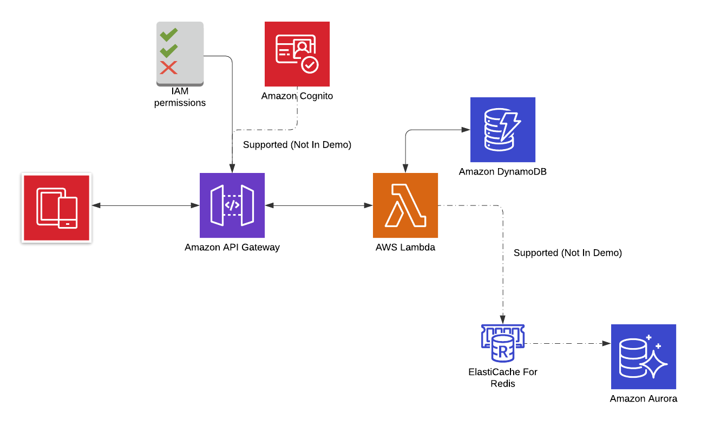

# AWS Lambda Go API via API Gateway with IAM API Authorization
This is an example go based Lambda API using Amazon API Gateway (with IAM authorization) and Dynamo DB. Dynamo DB config can be substituted for appropriate RDS/MySQL config in production. 

This Lambda function is designed “service style” e.g. one function will handle multiple actions and HTTP methods GET, POST etc. like a more traditional web service. Other Lambda configurations are discussed [here](https://www.serverless.com/blog/serverless-architecture-code-patterns/) but general architecture would be the same.


## Overview 



## Pre-requisites
1. Set Up AWS System Account: Create an aws system acount to use with the CLI. 
   I created an access group ('API_Access_Group') with the permissions policies I needed and 
   then attached my ('dev_system_account') to that group. Example permissions
```json
{
    "AttachedPolicies": [
        {
            "PolicyName": "AdministratorAccess",
            "PolicyArn": "arn:aws:iam::aws:policy/AdministratorAccess"
        },
        {
            "PolicyName": "AWSCodeDeployRoleForLambda",
            "PolicyArn": "arn:aws:iam::aws:policy/service-role/AWSCodeDeployRoleForLambda"
        },
        {
            "PolicyName": "AWSLambdaExecute",
            "PolicyArn": "arn:aws:iam::aws:policy/AWSLambdaExecute"
        },
        {
            "PolicyName": "AWSLambda_FullAccess",
            "PolicyArn": "arn:aws:iam::aws:policy/AWSLambda_FullAccess"
        },
        {
            "PolicyName": "AmazonS3ObjectLambdaExecutionRolePolicy",
            "PolicyArn": "arn:aws:iam::aws:policy/service-role/AmazonS3ObjectLambdaExecutionRolePolicy"
        }
    ]
}
```
1. Download AWS CLI Tools: [aws-cli](https://github.com/aws/aws-cli) and [aws-sam-cli](https://github.com/aws/aws-sam-cli)
1. Install AWS Curl Helper to make signed request against API backend (local testing): [awscurl](https://github.com/okigan/awscurl)


## Set up Lambda Role (Policy Files under configs/iam_policies)
1. Create Execution role for lambda function:
```bash
$ cd $(PROJECT_ROOT)/configs/iam_policies
$ aws iam create-role --role-name lambda-exec-role --assume-role-policy-document file://trust-policy.yaml
```
   
1. Attach Role permission polices:
```bash
$ aws iam attach-role-policy --role-name lambda-exec-role --policy-arn arn:aws:iam::aws:policy/service-role/AWSLambdaBasicExecutionRole
$ aws iam put-role-policy --role-name lambda-exec-role --policy-name dynamodb-item-crud-role --policy-document file://db-policy.json
```

## Create Function and Upload Function
1. Build source and Create Function 
```bash
$ env GOOS=linux GOARCH=amd64 go build -o /tmp/main menus
$ zip -j main.zip /tmp/main
$ aws lambda create-function --function-name menus --runtime go1.x \
--role <lambda-exec-role ARN > --handler main --zip-file fileb://main.zip
```

1. Create and pre-populate Dynamodb Table
```bash
$  aws dynamodb create-table --table-name Menus \
--attribute-definitions AttributeName=MENUID,AttributeType=S \
--key-schema AttributeName=MENUID,KeyType=HASH \
--provisioned-throughput ReadCapacityUnits=5,WriteCapacityUnits=5

$ aws dynamodb put-item --table-name Menus --item \
'{"MENUID":{"S": "978-1420931693"}, "restaurant":{"S": "The Republic"}, "cuisine":{"S": "Ameican-Casual"}}'

$ aws dynamodb put-item --table-name Menus --item \
'{"MENUID":{"S": "888-123454249"}, "restaurant":{"S": "Roma"}, "cuisine":{"S": "Italian"}}'
```

**Note**: Function will be callable at this point but fail due to lack of Gateway config, we will set that up next:
```bash
$ aws lambda invoke --function-name menus ./tmp.yaml

$ cat ./tmp.yaml
{"statusCode":405,"headers":null,"multiValueHeaders":null,"body":"Method Not Allowed"}
```


## Create and Configure API Gateway

1. Create API Gateway
```bash
$ aws apigateway create-rest-api --name foodstore

createdDate: '2021-10-12T16:27:31-04:00'
disableExecuteApiEndpoint: false
endpointConfiguration:
  types:
  - EDGE
id: <my-rest-api-id>
name: foodstore
```

1. Get root api resource ID. This is used to configure integration of lambda function as API resource under the gateway
```bash
aws apigateway get-resources --rest-api-id <my-rest-api-id>
  - items:
  - id: <my-root-resource-id>
    path: /
```

1. Create new resource path for Lambda function and register the function to handle all HTTP methods (via. ANY):

```bash
$ aws apigateway create-resource --rest-api-id <my-rest-api-id> --parent-id <my-root-resource-id> \
--path-part menus
- id: <menus-resource-id>
  parentId: <my-root-resource-id>
  path: /menus
  pathPart: menus

$ aws apigateway put-method --rest-api-id <my-rest-api-id> --resource-id <menus-resource-id> \
--http-method ANY --authorization-type AWS_IAM
- apiKeyRequired: false
  authorizationType: AWS_IAM
  httpMethod: ANY
```

1. Integrate with Lambda function and assign the API Gateway permissions
```bash
$ aws apigateway put-integration --rest-api-id <my-rest-api-id> --resource-id <menus-resource-id> \
--http-method ANY --type AWS_PROXY --integration-http-method POST --uri arn:aws:apigateway:us-east-1:lambda:path/2015-03-31/functions/arn:aws:lambda:us-east-1:<account-id>:function:menus/invocations

$ aws lambda add-permission --function-name menus --statement-id SOMEHASH_OR_GUID --action \ 
lambda:InvokeFunction --principal apigateway.amazonaws.com --source-arn \
'arn:aws:execute-api:us-east-1:<account-id>:<menus-resource-id>/*/*/*'
```

1. Test Endpoint
```bash
$ aws apigateway test-invoke-method --rest-api-id <my-rest-api-id> \
--resource-id <menus-resource-id> --http-method "GET" \
--path-with-query-string "/menus?menuid=888-123454249"
{
    "status": 200,
    "body": '{"menuid":"888-123454249","restaurant":"Roma","cuisine":"Italian"}',
    "headers": {
        "X-Amzn-Trace-Id": "sampled=0;root=1-5ac60df0-0ea7a560337129d1fde588cd"
    },
    "log": [TRUNCATED],
    "latency": 407
}
```
## Finally Deploy the Gateway for public HTTP Traffic

1. Deploy gateway for HTTP traffic, in ths case to a staging URL
```bash
$ aws apigateway create-deployment --rest-api-id  <my-rest-api-id> --stage-name staging

```

1. Calling URL from with unsigned request or unautorized IAM user results in error:
```bash
$  curl https://<my-rest-api-id>.execute-api.us-east-1.amazonaws.com/staging/menus?menuid=978-1420931693

{"message":"Missing Authentication Token"}

```


1. Using a signed request for authorized AWS user (in this case default aws-cli configured user  configured in ~/.aws/credentials) returns expected result.
```bash
$ awscurl --service execute-api https://<my-rest-api-id>.execute-api.us-east-1.amazonaws.com/staging/menus?menuid=978-1420931693
{"menuid":"888-123454249","restaurant":"Roma","cuisine":"Italian"}
```
## Notes
* Gateway method authorization supports [COGNITO_USER_POOLS](https://docs.aws.amazon.com/apigateway/latest/developerguide/apigateway-integrate-with-cognito.html).
* While regional endpoint deployments are possible, this API gateway is [edge optimized](https://docs.aws.amazon.com/apigateway/latest/developerguide/api-gateway-api-endpoint-types.html)  
* For Production we should [consider canary release deployments](https://docs.aws.amazon.com/apigateway/latest/developerguide/canary-release.html)
* We should have API release stages to mirror/track App release stages, particularlly for UAT and DEV. This will alow more controll over access, throttling and logging in those environments. 